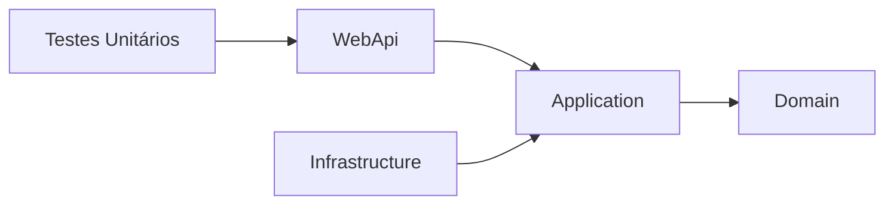
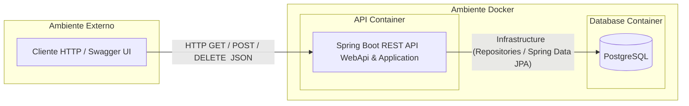

# Duxus Desafio - API de Gerenciamento de Escalação de Times

Uma API REST robusta desenvolvida em Java com Spring Boot para o gerenciamento de times e suas respectivas escalações. \
\
Este projeto resolve o desafio técnico proposto pela Duxus, focando na aplicação de regras de negócio complexas para análise de integrantes, times, funções e clubes em determinados períodos.

## Tecnologias Utilizadas

O projeto foi construído utilizando as ferramentas e práticas mais modernas do ecossistema Java:

- **Java 17+**: Linguagem principal.
- **Spring Boot**: Framework base para a criação da API REST.
- **Spring Data JPA & Hibernate**: Abstração e implementação de persistência de dados. O JPA atua como a especificação padrão do Java para mapeamento objeto-relacional (ORM), enquanto o Hibernate é o provider que traduz as entidades e repositórios em consultas SQL otimizadas.
- **PostgreSQL**: Banco de dados relacional.
- **H2 Database**: Banco de dados em memória, utilizado para testes e desenvolvimento ágil.
- **Docker & Docker Compose**: Contêinerização para garantir consistência de ambiente.
- **Swagger (OpenAPI 3)**: Documentação interativa da API.
- **JUnit 5 & Mockito**: Testes unitários para garantir a qualidade do software.

## Como rodar o projeto

A aplicação foi configurada para ser flexível e suporta diferentes ambientes através de **Spring Profiles**. Você pode executá-la utilizando:

- **H2 em memória** para desenvolvimento rápido e testes locais.
- **PostgreSQL local** para desenvolvimento com um banco real na sua máquina.
- **PostgreSQL via Docker Compose** para replicar o ambiente de contêiner.

### 1. Pré-requisitos

- Java 17 ou superior
- Maven
- Docker e Docker Compose (para rodar via contêiner)
- PostgreSQL local se quiser usar esse modo específico

### 2. Configurando o ambiente (`.env`)

Crie um arquivo `.env` na raiz do projeto com as variáveis abaixo.

#### Exemplo de `.env` para PostgreSQL local

```env
DB_HOST=localhost
DB_PORT=5432
DB_URL=jdbc:postgresql://localhost:5432/duxus
DB_USERNAME=postgres
DB_PASSWORD=sua_senha
SPRING_PROFILES_ACTIVE=postgres

# H2 profile (Banco em memória)
H2_URL=jdbc:h2:mem:duxus;DB_CLOSE_DELAY=-1;DB_CLOSE_ON_EXIT=FALSE
H2_DRIVER=org.h2.Driver
H2_USERNAME=sa
H2_PASSWORD=
H2_DIALECT=org.hibernate.dialect.H2Dialect
H2_DDL_AUTO=create-drop
H2_SHOW_SQL=true

# Test profile
TEST_DB_URL=jdbc:h2:mem:duxus-test;DB_CLOSE_DELAY=-1;DB_CLOSE_ON_EXIT=FALSE
TEST_DB_DRIVER=org.h2.Driver
TEST_DB_USERNAME=sa
TEST_DB_PASSWORD=
TEST_DB_DIALECT=org.hibernate.dialect.H2Dialect
TEST_DB_DDL_AUTO=create-drop
TEST_SHOW_SQL=false
```

#### Exemplo de `.env` para Docker Compose

```env
DB_HOST=localhost
DB_PORT=5433
DB_URL=jdbc:postgresql://localhost:5433/duxus
DB_USERNAME=postgres
DB_PASSWORD=sua_senha
SPRING_PROFILES_ACTIVE=docker

# H2 profile (Banco em memória)
H2_URL=jdbc:h2:mem:duxus;DB_CLOSE_DELAY=-1;DB_CLOSE_ON_EXIT=FALSE
H2_DRIVER=org.h2.Driver
H2_USERNAME=sa
H2_PASSWORD=
H2_DIALECT=org.hibernate.dialect.H2Dialect
H2_DDL_AUTO=create-drop
H2_SHOW_SQL=true
```

> **Importante:** quando o projeto roda no Docker, o host mapeado expõe o PostgreSQL em `localhost:5433` para evitar conflito com um PostgreSQL local em `5432`. O container da aplicação em Docker ainda acessa o banco pelo serviço interno `postgres:5432`.

### 3. Troubleshooting de PostgreSQL local

Se você usar `SPRING_PROFILES_ACTIVE=postgres` e receber um erro como:

- `Connection refused`
- `Connection to localhost:5433 refused`
- `UnknownHostException: postgres`

então provavelmente o banco PostgreSQL não está escutando no host/porta configurados.

Verifique:

- `DB_HOST` deve ser `localhost` ou o host correto do PostgreSQL local.
- `DB_PORT` deve ser a porta do PostgreSQL local.
- `DB_URL` deve refletir `DB_HOST` e `DB_PORT`, por exemplo:
  ```env
  DB_URL=jdbc:postgresql://localhost:5432/duxus
  ```
- `SPRING_PROFILES_ACTIVE=postgres` para usar `application-postgres.properties`.

Se estiver usando PostgreSQL local padrão na porta 5432, atualize no `.env`:

```env
DB_HOST=localhost
DB_PORT=5432
DB_URL=jdbc:postgresql://localhost:5432/duxus
SPRING_PROFILES_ACTIVE=postgres
```

Se a conexão na porta correta cair com erro de senha (`FATAL: autenticação do tipo senha falhou`), o Postgres está ativo, mas a senha de `postgres` está incorreta. Nesse caso, redefine a senha do usuário PostgreSQL local antes de rodar a aplicação:

```bash
sudo -u postgres psql
ALTER USER postgres WITH PASSWORD 'sua_senha';
\q
```

Depois atualize `DB_PASSWORD` no `.env` com a senha correta.

### 4. Perfis suportados

- `h2`: usa banco H2 em memória.
- `postgres`: usa PostgreSQL local configurado via `DB_URL`.
- `docker`: usa PostgreSQL dentro do Docker Compose.

### 4. Como executar

#### Opção A: H2 local

```bash
mvn spring-boot:run -Dspring-boot.run.arguments=--spring.profiles.active=h2
```

Ou altere no `.env`:

```env
SPRING_PROFILES_ACTIVE=h2
```

#### Opção B: PostgreSQL local

```bash
mvn spring-boot:run -Dspring-boot.run.arguments=--spring.profiles.active=postgres
```

Ou altere no `.env`:

```env
SPRING_PROFILES_ACTIVE=postgres
```

#### Opção C: Docker Compose com PostgreSQL

```bash
docker-compose up -d --build
```

### 5. Detalhes importantes

- O perfil `h2` é ideal para desenvolvimento rápido, pois não exige banco externo.
- O perfil `postgres` conecta a aplicação ao PostgreSQL local definido em `DB_URL`.
- O perfil `docker` conecta a aplicação ao serviço `postgres` definido em `docker-compose.yml`.
- Se nenhuma variável `SPRING_PROFILES_ACTIVE` estiver definida, o perfil padrão é `h2`.

### 6. Rodando testes

```bash
mvn clean test
```

---

## Como acessar a API

Com a aplicação rodando, a documentação interativa e os endpoints podem ser acessados via Swagger UI:

- **Swagger UI:** <http://localhost:8080/swagger-ui/index.html>
- **Documentação JSON:** <http://localhost:8080/v3/api-docs>

Lá você encontrará todos os endpoints mapeados para gerenciar Times, Integrantes e processar as lógicas de negócios.

## Como rodar testes unitários

Os testes unitários foram desenvolvidos para garantir o comportamento correto das regras de negócio complexas. Para executá-los, utilize o comando Maven na raiz do projeto:

```bash
mvn clean test
```

## Estrutura do Projeto

O projeto segue uma estrutura bem definida de separação em camadas, garantindo organização e manutenibilidade:

- `WebApi`: Camada de entrada. Recebe as requisições HTTP REST (Controllers) e lida com Middlewares.
- `Application`: Onde residem os contratos, DTOs e Interfaces (abstrações) que orquestram a aplicação.
- `Domain`: O coração do negócio, contendo as entidades puras e helpers.
- `Infrastructure`: Lida com serviços externos, repositórios (acesso a dados), e configurações como Seed do banco, exceções HTTP e Swagger.

## Arquitetura do Projeto

**Padrão arquitetural adotado:** Clean Architecture / Layered Architecture.

### Dependências do projeto



- `Domain`: Regras de negócio e entidades puras, além de helpers.
- `Application`: Camada central que define contratos (interfaces), DTOs e orquestra o fluxo.
- `Infrastructure`: Implementa os contratos da aplicação, lidando com persistência (Repositories), serviços e configurações (Seed, exceptions, Swagger).
- `WebApi`: Host HTTP, contém os Controllers e Middlewares, e executa a API.
- `Testes Unitários`: Projeto de testes para validar os componentes e regras de negócio.

## System Design



**Pontos chave**

- **Fluxo de Dados:** O cliente faz a requisição HTTP (REST) -> A `WebApi` recebe através dos Controllers e repassa para a `Application` -> A `Application` orquestra a execução da lógica de negócios utilizando abstrações -> A `Infrastructure` acessa os dados no PostgreSQL implementando as abstrações -> O fluxo retorna com a resposta mapeada ao cliente.
- **Separação de Responsabilidades (SoC):** Cada camada possui responsabilidades estritas e bem definidas. `WebApi` lida apenas com a rede e requests, `Application` com os fluxos e contratos, `Domain` com as regras cruciais e `Infrastructure` com os detalhes de persistência e frameworks externos.
- **Processamento em Memória (Java Streams):** Várias das consultas complexas exigidas no desafio foram solucionadas de forma declarativa, elegante e com alta performance através do uso intensivo da API de **Java Streams** no processamento das coleções em memória.

## Regras de Negócio Implementadas

A API resolve as seguintes regras de negócio, conforme exigido no desafio:

1. **TimeDaData**: Retorna a escalação completa de um time para uma data específica.
2. **IntegranteMaisUsado**: Identifica qual integrante esteve presente em mais times dentro de um período estipulado.
3. **IntegrantesDoTimeMaisRecorrente**: Lista os integrantes do time mais comum em um determinado intervalo de tempo.
4. **FuncaoMaisRecorrente**: Descobre a função (ex: Atacante, Goleiro, etc.) mais utilizada em todas as escalações de um período.
5. **ClubeMaisRecorrente**: Avalia os clubes/franquias que mais cederam jogadores para as escalações no intervalo.
6. **ContagemDeClubesNoPeriodo**: Calcula o total de clubes distintos envolvidos nas escalações de um determinado período.
7. **ContagemPorFuncao**: Gera um relatório com a quantidade de membros agrupados por suas funções em um intervalo de datas.

## Design Patterns Utilizados

- **Service Layer**: Encapsulamento das regras de negócios em uma camada específica, removendo lógica do Controller.
- **Repository Pattern (Spring Data JPA)**: Abstração do acesso a dados. O Spring Data implementa o padrão Repository em conjunto com a especificação **JPA** e o **Hibernate**, o que facilita imensamente a troca de SGBDs (ex: do PostgreSQL para o H2) sem a necessidade de reescrever as lógicas de CRUD.
- **DTO (Data Transfer Object)**: Separação das entidades de banco de dados do modelo exposto na API, protegendo o domínio e controlando exatamente quais dados trafegam pela rede.

## Persistência de Dados: JPA e Hibernate

O projeto faz uso intensivo do ecossistema de dados do Spring, combinando **JPA** (Java Persistence API) e **Hibernate**:

- **JPA (A Especificação)**: Fornece as anotações padrão do Java (como `@Entity`, `@Table`, `@Id`, `@OneToMany`, etc) para descrever o modelo relacional de forma orientada a objetos. Ela define as regras do jogo e garante que as entidades da camada de `Domain` sejam independentes de fornecedores específicos.
- **Hibernate (A Implementação)**: Atua como a "engine" por trás da JPA. É ele quem realiza o trabalho pesado de ler as anotações, mapear os objetos e gerar dinamicamente as queries SQL (seja para PostgreSQL, usando os dialetos específicos, ou para H2) e gerenciar o ciclo de vida das transações, o cache e o Lazy Loading das coleções. O Hibernate poupa a escrita manual de instruções SQL repetitivas e eleva o nível de abstração.

## Problemas Resolvidos

Durante o desenvolvimento, os seguintes desafios arquiteturais e técnicos foram superados:

- **Conversão de Datas no Spring (`@DateTimeFormat`):** Resolução de problemas na deserialização de datas vindas da requisição (URL ou JSON) para os tipos nativos do Java (`LocalDate`), assegurando o formato padrão.
- **Configuração de Ambiente com Docker:** Orquestração da inicialização da API, garantindo que a aplicação Spring Boot consiga se conectar e inicializar perfeitamente no ecossistema de contêineres juntamente com o banco de dados.
- **Desacoplamento entre Camadas:** Adoção estrita de mapeamento entre Entidades e DTOs para evitar problemas clássicos do Hibernate como o _LazyInitializationException_ e não expor informações confidenciais do modelo interno.

## Exemplos de Requisições e Respostas JSON

### Exemplo 1: Consultar a Função Mais Recorrente

**Requisição (GET):**

```http
GET /api/v1/escalacao/funcao-mais-recorrente?dataInicial=2023-01-01&dataFinal=2023-12-31
```

**Resposta (200 OK):**

```json
{
  "funcao": "Atacante",
  "quantidade": 15
}
```

### Exemplo 2: Adicionar um Integrante

**Requisição (POST):**

```http
POST /api/v1/integrantes
Content-Type: application/json

{
  "nome": "João Silva",
  "funcao": "Goleiro",
  "clube": "Duxus FC"
}
```

**Resposta (201 Created):**

```json
{
  "id": 1,
  "nome": "João Silva",
  "funcao": "Goleiro",
  "clube": "Duxus FC"
}
```

## Considerações Finais

Este projeto foi desenvolvido com forte foco na qualidade do código, legibilidade e manutenibilidade. O uso de design patterns modernos, arquitetura em camadas e o processamento de regras complexas utilizando Java Streams refletem o compromisso com as melhores práticas da engenharia de software. A API está estruturada de maneira limpa, pronta para ser facilmente testada, estendida e implantada em ambientes produtivos.
