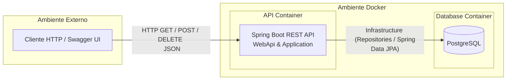
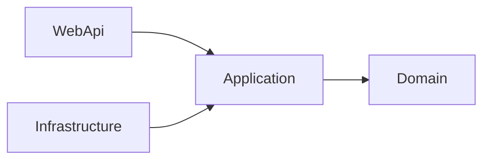

# Arquitetura

## Padrão

Clean Architecture / Layered Architecture

## Camadas

- **WebApi**: Controllers e entrada HTTP
- **Application**: Casos de uso, DTOs e interfaces
- **Domain**: Regras de negócio puras
- **Infrastructure**: Persistência, configs e integrações

### System Design

**Pontos chave**

- **Fluxo de Dados:** O cliente faz a requisição HTTP (REST) -> A `WebApi` recebe através dos Controllers e repassa para a `Application` -> A `Application` orquestra a execução da lógica de negócios utilizando abstrações -> A `Infrastructure` acessa os dados no PostgreSQL implementando as abstrações -> O fluxo retorna com a resposta mapeada ao cliente.
- **Separação de Responsabilidades (SoC):** Cada camada possui responsabilidades estritas e bem definidas. `WebApi` lida apenas com a rede e requests, `Application` com os fluxos e contratos, `Domain` com as regras cruciais e `Infrastructure` com os detalhes de persistência e frameworks externos.
- **Processamento em Memória (Java Streams):** Várias das consultas complexas exigidas no desafio foram solucionadas de forma declarativa, elegante e com alta performance através do uso intensivo da API de **Java Streams** no processamento das coleções em memória.

## Diagrama

## Benefícios

- Baixo acoplamento
- Alta testabilidade
- Facilidade de manutenção

