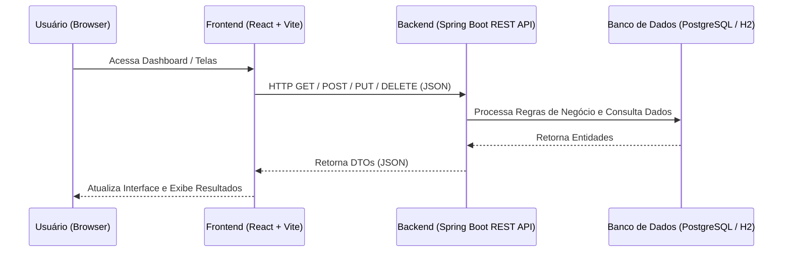

# Frontend

## Tecnologias

- React
- TypeScript
- Vite

## Repositório

[Link do Repositório](https://github.com/FeJoestar18/desafioDX-Front.git)

## Integração

O frontend consome a API via endpoints REST.

## Como executar

No repositório do frontend:

```bash
npm install
npm run dev
```

Em paralelo, execute este backend e certifique-se de que a API esteja disponível em `http://localhost:8080`.

## Configuração de API

- Endpoint base da API: `http://localhost:8080`
- O frontend está preparado para consumir os serviços REST deste backend.

### Diagrama de Comunicação



## Objetivo

Prover uma interface web intuitiva e reativa que permita aos usuários gerenciar facilmente a escalação de times e integrantes. A aplicação foi construída com foco em simplicidade e excelente experiência do usuário (UX), consumindo de forma eficiente a API REST para exibir as análises e relatórios propostos no desafio técnico.

## Observação

A adoção de uma arquitetura desacoplada — com um repositório exclusivo para o Frontend consumindo a API REST do Backend — foi uma decisão de design intencional. Essa abordagem garante a independência tecnológica das camadas, permitindo que ambas escalem, sejam testadas e evoluam de forma autônoma, além de seguir as melhores práticas do mercado para aplicações modernas.
